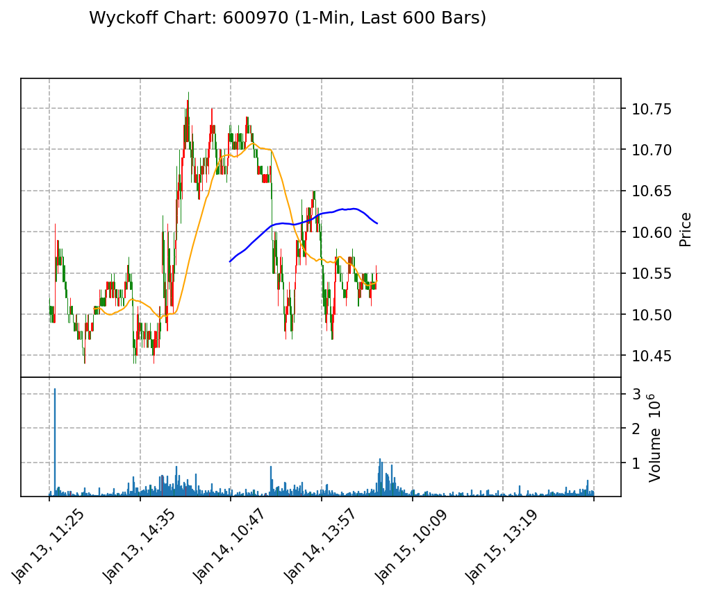

# 威科夫分析报告

## 1. Background (位置与趋势)
当前微观结构显示出明显的**吸筹**特征。成交量在多个时间段内出现了显著的增加，尤其是在13:37到14:00之间，成交量达到了334,600和198,400等高点，表明买方在积极进场。整体来看，供求关系中，**需求占优**，显示出市场对该标的的强烈购买意愿。

## 2. Key Events (关键行为)
在分析过程中，我们识别出以下关键行为信号：
- **Spring**：在13:18到13:19之间，成交量为8,600，随后在13:20时成交量回升至80,800，显示出买方的强烈反弹。
- **LPS (Last Point of Support)**：在14:00时，成交量为84,700，随后继续上涨，表明市场在此处建立了支撑。
- **UT (Upthrust)**：在14:49到14:50之间，成交量高达202,400，可能是卖方试图派发的信号，但随后的成交量仍然维持在高位，表明买方仍在主导市场。

结合“努力与结果”的分析，尽管出现了高成交量的UT信号，但后续的成交量仍然表明买方的持续努力，未能有效地引发价格下跌，表明市场仍在吸筹阶段。

## 3. Trade Plan (交易计划)
- **做多信号**：如果价格突破14:50的高点，并伴随成交量持续增加，确认买方的强势，可以考虑做多。
- **做空信号**：如果价格跌破14:00的支撑位，并伴随成交量显著增加，表明卖方开始占优，可以考虑做空。
- **止损位**：若做多，止损位设在14:00的支撑位下方；若做空，止损位设在14:50的高点上方。

通过以上分析，我们可以更好地把握市场动态，制定相应的交易策略。